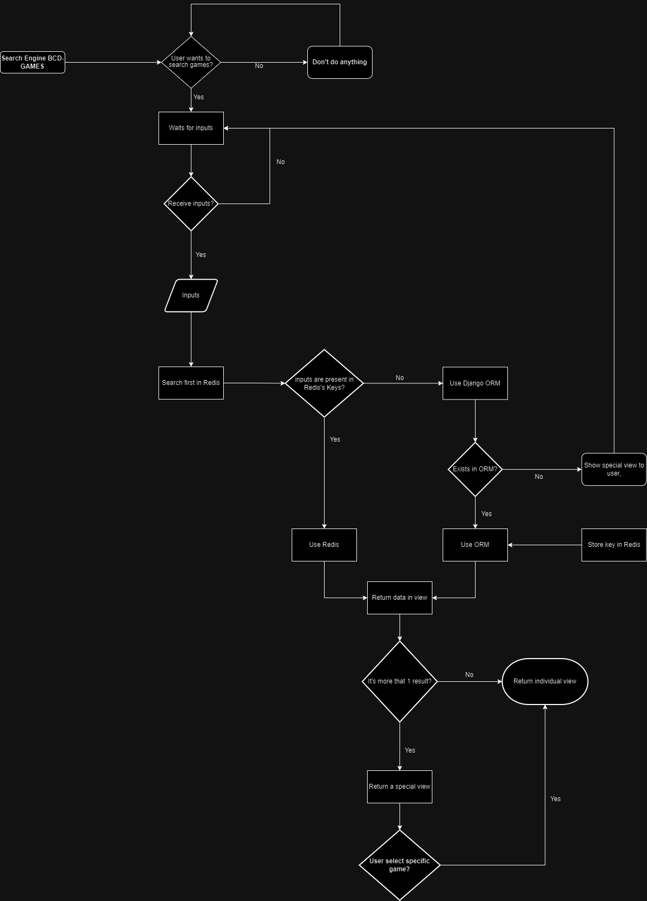
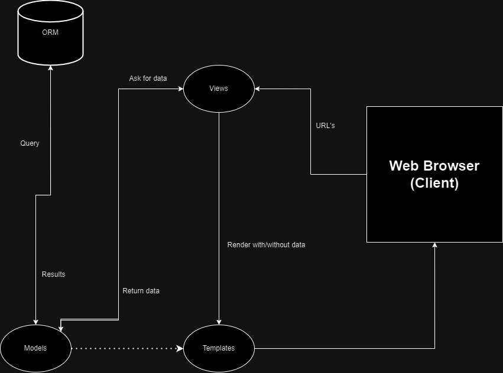
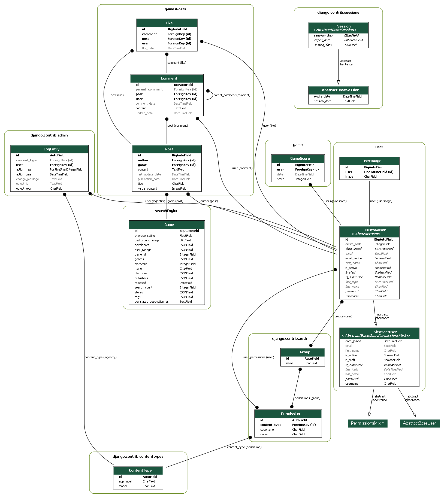
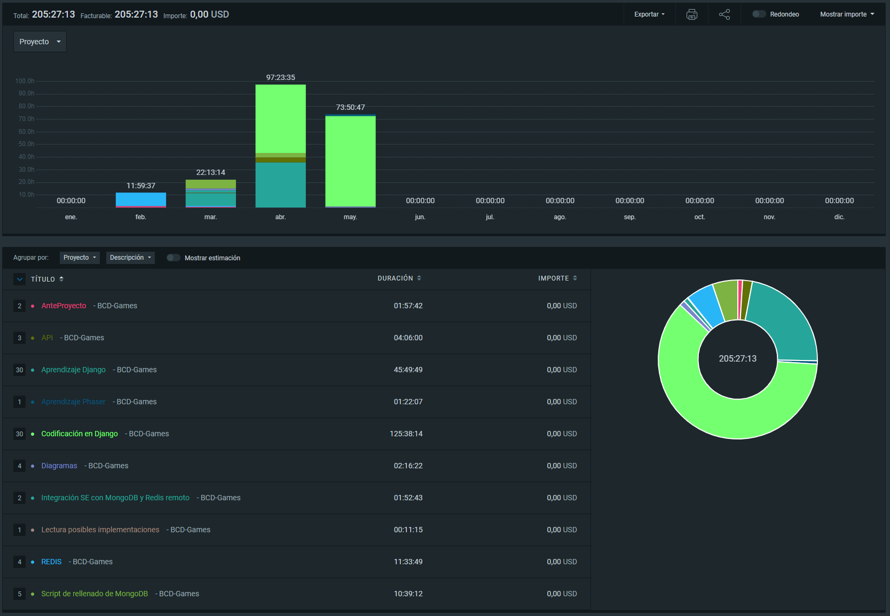

# BCD-Games

## índice

1. [Introducción](#introducción)
2. [Descripción del proyecto](#descripción-del-proyecto)

   - [Aplicaciones desarrolladas](#aplicaciones-desarrolladas)

     - [SearchEngine](#searchengine)
       - [Diagrama de casos de usos](#diagrama-de-casos-de-usos)
     - [Posts](#posts)
     - [Portal Social](#portal-social)
     - [Videojuego](#videojuego)

   - [Arquitectura del proyecto](#arquitectura-del-proyecto)
     - [Diagrama MVT](#diagrama-mvt)
   - [Diagrama E-R](#diagrama-e-r)

3. [Tecnologías utilizadas](#tecnologías-utilizadas)
4. [Cómo instalar y utilizar la aplicación](#cómo-instalar-y-utilizar-la-aplicación)
5. [Futuras funcionalidades a añadir](#futuras-funcionalidades-a-añadir)
6. [Inconvenientes durante el desarrollo](#inconvenientes-durante-el-desarrollo)
7. [Más información](#más-información)

## Introducción

BCD-Games es un proyecto de fin de curso para la titulación de la **Formación Profesional de Desarrollo de Aplicaciones Webs** realizado durante los años 2022-2024 en el [Centro Integrado de Formación Profesional Francesc de Borja Moll](https://www.cifpfbmoll.eu/) ubicado en **Palma de Mallorca**.

## Descripción del proyecto

Se trata de un proyecto realizado durante el último trimestre de la Formación Profesional de DAW.

Este proyecto aparece debido a que, en el sector de los videojuegos, existe una gran disparidad de opiniones debido al crecimiento exponencial de usuarios que disfrutan más este mundo. Además, cada vez son más los usuarios que intentan buscar información de forma objetiva en internet o, de forma más concreta, en redes sociales.

Un ejemplo de ello es Twitter, una red social donde cada vez son más las opiniones destructivas y negativas que sufren un videojuego, llevando a otros usuarios a no disfrutarlos.

Para ello, se ha creado **BCD-Games**. Una plataforma donde se busca unificar tanto la información objetiva como la información subjetiva mediante un sistema de búsqueda y un portal de posts de forma gratuita.

A continuación, se entrará en más detalles de las aplicaciones desarrolladas, sus funcionalidades y las tecnologías utilizadas para el correcto desempeño de las aplicaciones.

### Aplicaciones desarrolladas

#### SearchEngine

Se ha desarrollado un Search Engine enfocado principalmente en la optimización y la performance del mismo.

El objetivo de esta aplicación es otorgar a los usuarios la información objetiva de un videojuego que ellos quieran saber, utilizando el buscador como filtro.

Para ello, se ha desarrollado una versión preliminar utilizando **[Python](https://www.python.org/)**, **[Redis](https://redis.io/)**, una API externa de una Base de Datos de videojuegos conocida como **[RAWG](https://rawg.io/)**, y una base de datos en remoto no relacional conocida como **[MongoDB Atlas](https://www.mongodb.com/es/lp/cloud/atlas/try4)**

Tras el desarrollo, se ha analizado frameworks de Python, decantándose al final por **[Django](https://www.djangoproject.com/)**, gracias a su seguridad, optimización y escalabilidad.

Algo a destacar es que la versión preliminar de esta aplicación tenía una gran dependencia de la API y sufría una ralentización tanto de peticiones hacia la API externa como peticiones en remoto a la base de datos. Como solución, se ha vuelto a analizar y se ha optado por usar el propio ORM de Django, quitando las dependencias externas y optimizando aún más la performance.

Por último, se ha de destacar varias funcionalidades que otorgan una mejor experiencia de usuario, como el autocompletado mientras se busca, el filtro de los videojuegos en función a su número de búsquedas, destacando el videojuego más búscado por encima del resto, y, por último, el guardado en sesión de las últimas búsquedas realizadas por el usuario durante su sesión.

A continuación, se presenta un diagrama de caso de uso que se ha seguido durante el proceso de desarrollo:

##### Diagrama de casos de usos



#### Posts

Se ha desarrollado un sistema de posts que permite una posibilidad de ofrecer una información subjetiva por parte de los propios usuarios.

Para este sistema, se ha tomado como referencia **[Reddit](https://www.reddit.com/)**, uno de los mayores portales de posts de Internet, donde todos los usuarios registrados pueden crear sus propios posts dando opinión de cualquier temática.

Mientras se desarrollaba esta aplicación, se tenía en cuenta una función preliminar base del sistema de autenticación posteriormente anunciada.

Esta aplicación permite a los usuarios anónimos y registrados poder ver los posts creados de forma reciente. Los usuarios anónimos **no** pueden listar sus posts creados ni pueden crear un posts.

Para crear un post, un usuario registrado tendrá acceso a un formulario donde indicará un título, un contenido textual, una imagen (si lo prefiere) y el juego con el que estará relacionado el post.

Tras ello, se generará el post de forma que aparecerá en el listado de posts recientes.

En la visualización de un post en concreto, un usuario registrado podrá dar like al post, escribir un comentario, una respuesta a un comentario, y dar like a ambos tipos de comentarios. Si un usuario es autor de un comentario, se le permitirá actualizar y borrar el comentario. Lo mismo para las respuestas.

Además, cada nombre de usuario estará linkeado con su perfil social que se entrará en detalles posteriormente. En el caso del nombre del videojuego, se enlaza con la lógica del Search Engine, haciendo que un usuario pueda tener acceso a la información objetiva del juego al que se hace referencia.

Otra funcionalidad dentro de la visualización del post es la posibilidad de compartir el mismo post por redes sociales como Facebook o Twitter (actualmente X).

Por último, quedaría indicar un apartado para los usuarios autores de un posts, donde podrán ver, editar o borrar sus posts creados.

#### Portal Social

Se ha creado un sistema de autenticación y de registro de usuarios extendiendo las funcionalidades básicas otorgadas por Django y mejorando aún más tanto la validación base como implementando un sistema de mensajería para verificación de usuarios.

Para que un usuario se considere verificado, deberá introducir un código numérico aleatorio entre 0 y 999.999 para poder verificarse y tener acceso a las funcionalidades limitadas.

Además, se añade la implementación de la edición de usuarios para que cada usuario pueda cambiar tanto su nombre, como su correo, su contraseña, su avatar, entre otros.

El sistema de avatares ha tenido un primer desarrollo donde los usuarios podían añadir su propio avatar, pero tras revisar posibles inconvenientes legales, se ha decantado por avatares por defecto.

Por último, se ha creado un site social donde tanto usuarios anónimos como usuarios registrados pueden ver de forma gratuita la actividad realizada por los mismos. Entre las actividades realizadas, se encuentran los posts que han creado, los comentarios realizados, ya sean hacia los posts o hacia otros comentarios, los likes que han dado, y las partidas realizadas en un intervalo de un día.

#### Videojuego

Se ha creado una versión preliminar de un videojuego que servirá para un desarrollo de una funcionalidad de canjeo de puntos en base a partidas y puntuaciones conseguidas.

Esta funcionalidad actualmente está en análisis, debido a que se trata de un sector que, aunque esté ligado con los videojuegos, implica acuerdos con tiendas, entre otros...

La versión preliminar permite jugar partidas y, una vez terminada, enseñar una tabla de puntuación de los 10 mejores actualizada en tiempo real.

### Arquitectura del proyecto

La arquitectura del proyecto que se ha utilizado es el patrón Modelo Vista Controlador, aunque bajo la nomenclatura de Django de **Modelo Vista Template**. A continuación, se presentará un diagrama que enseña el flujo de este patrón de forma general:

#### Diagrama MVT



### Diagrama E-R

Se enseñará, mediante un diagrama Entidad Relación, los modelos que se utilizan para el correcto funcionamiento de la aplicación:


### Tecnologías utilizadas

Las tecnologías que se han utilizado para el desarrollo de esta aplicación son las siguientes:

- **Python**: Se trata de un lenguaje de programación de alto nivel interpretado que hace hincapié en la legibilidad de su código. Es un lenjuage que soporta de forma parcial tanto la Programación Orientada a Objetos, programación imperativa como programación funcional.

- **Django**: Se trata de un framework web de alto nivel de Python que alienta un desarrollo rápido y limpio con un diseño pragmático. Es open source y totalmente gratuito, y sus características más destacadas son su optimización y performance, su seguridad, y su capacidad de escalabilidad.

- **Redis**: Es una base de datos en memoria de código abierto, utilizada como almacenamiento de estructura de datos, cache y agente de mensajes, conocida por su alta velocidad y eficiencia en el manejo de datos. Se utiliza en la aplicación en forma de caché guardando las id's y los nombres de los videojuegos con una expiración de 1 día.

- **MongoDB(al inicio)**: Es una base de datos NoSQL de código abierto que almacena datos en formato JSON, permitiendo el manejo de grandes volúmenes de datos de manera flexible y escalable. Durante el desarrollo, se ha encontrado con grandes inconvenientes, entre otro, por lo que se ha decantado por utilizar el propio ORM de Django.

- **Django Templates**: Son las platillas otorgadas por Django que permiten la inclusión de variables renderizadas por las vistas. Además, permite la extensión de otros templates, facilitando de esa forma una forma de desarrollo de componentes comunes para varias templates. Se hace bajo la filosofía de "Sólo se escribe una vez", evitando repetición de código. El uso de estas templates se complementan con:

  - **HTML**: Es el lenguaje estándar utilizado para crear y estructurar páginas web. Utiliza una serie de elementos o etiquetas para definir el contenido, como párrafos, encabezados, enlaces, imágenes y otros componentes multimedia. Cada etiqueta tiene un propósito específico y puede incluir atributos adicionales para proporcionar más información o personalizar la apariencia y funcionalidad del contenido

  - **CSS**: Es un lenguaje utilizado para describir la presentación y el diseño de las páginas web, controlando aspectos como colores, fuentes, márgenes y disposición de los elementos.

  - **JavaScript**: Es un lenguaje de programación que permite crear contenido interactivo y dinámico en páginas web, manejando eventos, validaciones de formularios, animaciones y comunicación con servidores. Se ha utilizado para el desarrollo del modo oscuro y de la lógica del videojuego.

  - **JQuery**: Es una biblioteca de JavaScript que simplifica la manipulación del DOM, la gestión de eventos, las animaciones y las solicitudes AJAX, facilitando el desarrollo web interactivo. Se ha utilizado en la aplicación, principalmente, para las funcionalidades de autocompletado, cargas de puntuaciones y likes y comentarios en posts.

  - **Bootstrap**: Es un framework de código abierto para el desarrollo de sitios web y aplicaciones móviles, que proporciona plantillas de diseño con HTML, CSS y JavaScript para crear interfaces responsivas y atractivas de manera rápida y sencilla.

### Cómo instalar y utilizar la aplicación

Para utilizar la aplicación, se debe realizar los siguientes pasos:

1. Copia el repositorio en una carpeta local utilizando:

```bash
git clone https://github.com/JLDJR2481/BCD-Games.git
```

2. Crea un entorno virtual, actívalo e instala las dependencias necesarias:

```bash
python -m venv <nombre-entorno>

source <nombre-entorno>/Scripts/activate

pip install -r requirements.txt
```

3. Crea un archivo .env y añade las siguientes variables necesarias:

- REDIS_HOST: Se trata de la URI que otorga Redis una vez creada una base de datos.
- REDIS_USER: Usuario de Redis para acceder a la base de datos
- REDIS_PASSWORD: Contraseña del usuario de Redis

- SECRET_KEY: Se trata de la clave que otorga Django para el funcionamiento de la aplicación. En este proyecto, se ha dejado 2 formas de poder obtener la SECRET_KEY

- SMTP_USER: Email que se utilizará para el servicio de mail de Google
- SMTP_PASS: Contraseña del email
- SMTP_APP_PASS: Clave de aplicación otorgada por Google para utilizar de forma correcta la aplicación.

4. Ejecuta el servidor de Django mediante el siguiente comando en la raíz del proyecto

```bash
python manage.py runserver
```

### Futuras funcionalidades a añadir

Se tiene pensado añadir varias mejoras y funcionalidades en el futuro. Estas son:

- Sistema de aletoriedad de videojuegos y más cantidad de juegos.
- Mejora del sistema social, dando la opción de chatear con otros usuarios, recepción de notificaciones por posts creados por usuarios que se han seguido.
- Escalabilidad de datos a disposición en base a los videojuegos. Actualmente solo hay 6000 juegos, pero en el mundo existen más de 600.000.
- Dockerización de la aplicación, para facilitar la escalabilidad de la aplicación creando múltiples instancias de contenedores.

### Inconvenientes durante el desarrollo

Han habido un par de inconvenientes que han impedido el refuerzo total de los aprendizajes durante la Formación Profesional:

- Ausencia de casos tests: No se han realizado una batería de pruebas, por lo que en caso de fallo, hay una probabilidad elevada de no conocer la causa del fallo.
- Ausencia de logs: No se ha implementado un sistema de logs que permitan conocer el correcto funcionamiento de la aplicación.
- Falta de internacionalización: No se ha desarrollado una internacionalización, haciendo que la aplicación sea, actualmente, solo para los jugadores hispanohablantes.
- Falta de servidores de despliegues de aplicaciones Django accesibles: Se planteaba usar PythonAnywhere para el despliegue, pero se ha encontrado que la dependencia principal, la cual es Redis, no eran compatible, haciendo que no se pueda hacer el despliegue.

Se plantea desarrollar las funcionalidades para estos inconvenientes para realizar una escalabilidad correcta y sin muchos errores.

### Más información

Durante el desarrollo de este proyecto, se ha utilizado un sistema reducido de Git Flow, donde existen 3 ramas:

- Master: Se trata de la rama principal, donde se recoge el código final.
- Prod: Esta rama se ha creado previamente al problema ocurrido con Redis. Se trata de una rama donde se subirá el código actualizado para el despliegue de la aplicación.
- Dev: Se trata de la rama donde se desarrollará toda funcionalidad futura. Es donde se desarrolla, comprueba y testea el código nuevo para evitar subidas que puedan afectar a prod.

A continuación, se mostrará, mediante clockify, las horas utilizadas para el desarrollo de este proyecto:

